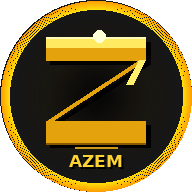

<div dir="rtl">

# ⚡ عزم — AZEM

<div align="center">



### تطبيق لياقة بدنية شخصي — بدون إنترنت، بدون اشتراك

[](https://chi-hani.github.io/AZEM6/)


</div>

---

## ما هو عزم؟

**عزم** تطبيق ويب تقدمي (PWA) للياقة البدنية يعمل على أي جهاز دون تثبيت. المستخدم يختار برنامجه (مبتدئ 21 يوم أو متقدم 30 يوم)، يحدد هدفه، ويبدأ فوراً.

---

## ✨ المميزات

### 🏠 الصفحة الرئيسية
- تحية شخصية حسب الوقت واسم المستخدم
- إحصاء سريع: اليوم الحالي، السلسلة، السعرات
- شريط تقدم البرنامج
- زر "ابدأ تدريب اليوم" مباشرة

### 🏋️ التدريب
- **16 تمرين مدمج** بصور متحركة — بيربيز، ضغط، قرفصاء، بلانك، نط الحبل، متسلق الجبل وغيرها
- **جلسة موجهة** مع عداد تنازلي، مجموعات، راحة تلقائية بين التمارين
- **تحميل تدريجي** — التكرارات تزيد كل أسبوع
- **محرر الجدول** — أضف أو عدّل أو احذف تمارين أي يوم بالسحب والإفلات
- **تمارين مخصصة** — أضف تمارينك مع صور أو GIF
- **يوم الراحة** قابل للتعديل — اضغط "✏️ تعديل اليوم" لإضافة تمارين
- التحويل التلقائي: حذف آخر تمرين → يوم راحة / إضافة تمرين → يوم تدريب

### ⏱️ الأدوات
- **مؤقت** مع حلقة بصرية وأوضاع متعددة
- **تاباتا** — دورات عمل/راحة تلقائية كاملة
- **نط الحبل** — عداد قفزات وأمتار وسعرات في الوقت الفعلي

### 📊 التتبع والتقدم
- سجل يومي بالسعرات والمدة والتمارين
- سلاسل الأيام المتواصلة
- مقارنة أسبوعية وتقويم شهري
- قياسات الجسم (وزن، خصر، صدر)
- شارات الإنجاز (10 شارات)
- مشاركة التقدم

### 🥗 التغذية
- يوميات التغذية اليومية
- حساب السعرات بناءً على الوزن والهدف (BMR)
- قاعدة بيانات أطعمة متكاملة

### 🤖 المدرب الذكي
- مدعوم بـ **Groq AI** (llama-3.3-70b-versatile)
- يحلل سجلك ويعطي نصائح شخصية مبنية على بياناتك
- يتذكر آخر **40 رسالة** + آخر صورة وملف PDF
- يتحكم في التطبيق عبر أوامر ذكية (FITCMD):
  - تعديل تمارين أي يوم
  - برمجة أسبوع كامل
  - إنشاء تمارين جديدة
  - تغيير الثيم والوضع
- يسأل "هل أطبقه؟" قبل تطبيق البرنامج
- ردود منسقة بعناوين ونقاط وقوائم
- زر "اقرأ أكثر" للردود الطويلة
- يعمل **محلياً** بدون API بردود ذكية مسبقة
- دعم رفع الصور وملفات PDF

### 🎨 التخصيص

| الثيمات (7) | أوضاع العرض (2) | اللغات (3) |
|-------------|-----------------|------------|
| 🌑 داكن | 📱 جوال | العربية |
| 🔥 ناري | 🖥️ كمبيوتر | English |
| 🌊 بحري | | Français |
| 🌿 طبيعي | | |
| ⚡ نيون | | |
| 🔮 بنفسجي | | |
| ☀️ فاتح | | |

### ☁️ المزامنة السحابية
- تسجيل الدخول بـ Google
- حفظ جميع البيانات على Firestore
- مزامنة تلقائية بين الأجهزة
- الصور المخصصة تبقى محلياً فقط (لا ترسل للسحابة)

### 🔔 الإشعارات
- تذكير يومي بوقت التدريب
- يعمل حتى عند إغلاق التطبيق (عبر Service Worker)

---

## 🚀 التثبيت

### على الهاتف
1. افتح الرابط في Chrome أو Safari
2. اضغط **"إضافة إلى الشاشة الرئيسية"** أو زر التثبيت 📲
3. يعمل بدون إنترنت ✅

### على الكمبيوتر
1. افتح الرابط في Chrome أو Edge
2. اضغط أيقونة التثبيت في شريط العنوان
3. يعمل كتطبيق مستقل ✅

---

## 📴 هل يعمل أوفلاين؟

**نعم** — بعد أول زيارة، الـ Service Worker يحفظ جميع الملفات محلياً. التطبيق يعمل بالكامل بدون إنترنت.

> الاستثناء الوحيد: **المدرب الذكي بالـ AI** يحتاج اتصالاً بـ Groq API. بدون إنترنت يعمل بالوضع المحلي.

---

## 🤖 إعداد المدرب الذكي (اختياري)

التطبيق يعمل تلقائياً بمفتاح مشترك. للحصول على أولوية أعلى:

1. احصل على مفتاح مجاني من [console.groq.com/keys](https://console.groq.com/keys)
2. افتح **الإعدادات ⚙️** داخل التطبيق
3. أدخل المفتاح في حقل **"مفتاح Groq API الشخصي"** ← احفظ

---

## 📁 هيكل الملفات

```
AZEM6/
├── index.html          # هيكل التطبيق
├── gifs.js             # صور التمارين المتحركة (base64 ~11MB)
├── sw.js               # Service Worker (v20)
├── manifest.json       # إعدادات PWA
├── icon-192-2.png      # أيقونة 192×192
├── icon-512-2.png      # أيقونة 512×512
├── icon-azem.svg       # أيقونة SVG
├── css/
│   └── styles.css      # جميع الأنماط
└── js/
    ├── data.js         # الحالة والتخزين والتمارين
    ├── audio.js        # الصوت والإعدادات
    ├── i18n.js         # الترجمة (AR/EN/FR)
    ├── timer.js        # المؤقت والتاباتا
    ├── session.js      # الجلسة الموجهة
    ├── render.js       # العرض الرئيسي
    ├── editor.js       # محرر الأيام والـ Onboarding
    ├── ui.js           # الواجهة العامة
    ├── coach.js        # المدرب الذكي
    ├── charts.js       # الرسوم البيانية
    ├── nutrition.js    # يوميات التغذية
    └── firebase.js     # المزامنة السحابية
```

---

## ⚙️ التقنيات

- **Vanilla JS** بدون أي framework
- **Web Audio API** للأصوات والنطق التحفيزي
- **Speech Synthesis API** للصوت التحفيزي العربي
- **Service Worker** للعمل أوفلاين
- **localStorage** لحفظ البيانات محلياً
- **Firebase Firestore** للمزامنة السحابية
- **Groq API** للمدرب الذكي (llama-3.3-70b-versatile)
- **Chart.js** للرسوم البيانية
- **Google Fonts** (Cairo, Tajawal, Inter)

---

## 📞 التواصل

هل لديك مشكلة أو اقتراح؟ راسلنا: [azem.chihani@gmail.com](mailto:azem.chihani@gmail.com)

---

<div align="center">

**⚡ عزم — Determination — Détermination**

🇩🇿 صُنع بالعزيمة

</div>

</div>
